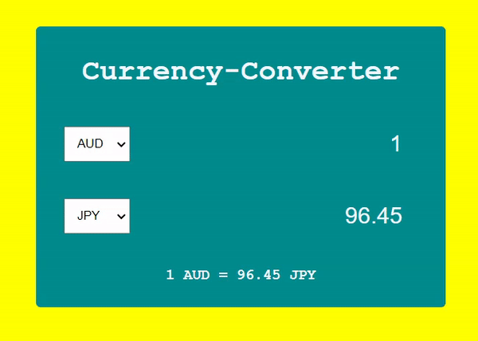

# Currency-Converter


## 기능  
환율 계산기  
 
*참고*   
AUD : 오스트레일리아 달러  
CAD : 캐나다 달러  
EUR : 유로  
GBP : 파운드 스털링  
INR : 인도 루피  
JPY : 일본 엔  
USD : 미국 달러  

## API   
https://www.exchangerate-api.com/  

__문서 읽어보기__   
https://www.exchangerate-api.com/docs/standard-requests  

## 학습  
### 1. JS : change 이벤트   
사용자가 `<input>`, `<select>`, `<textarea>` 요소의 값을 변경할 때 발생 __(요소 변경이 끝나면 발생)__  

__텍스트 입력 요소인 경우에는 요소 변경이 끝날 때가 아니라 포커스를 잃을 때 이벤트가 발생합니다.__
```
<label>
  아이스크림 맛을 선택하세요.
  <select class="ice-cream" name="ice-cream">
    <option value="">선택…</option>
    <option value="초콜릿">초콜릿</option>
    <option value="정어리">정어리</option>
    <option value="바닐라">바닐라</option>
  </select>
</label>

<div class="result"></div>
```
```
const selectElement = document.querySelector(".ice-cream");

selectElement.addEventListener("change", (event) => {
  const result = document.querySelector(".result");
  result.textContent = `${event.target.value} 맛을 좋아하시는군요`;
});
```


### 2. JS : input 이벤트   
사용자가 `<input>`, `<select>`, `<textarea>` 요소의 value가 바뀔 때 발생 __(사용자가 값을 수정할 때마다 발생)__    
```
<input placeholder="텍스트 입력" name="name" />
<p id="values"></p>
```
```
const input = document.querySelector("input");
const log = document.getElementById("values");

input.addEventListener("input", updateValue);

function updateValue(e) {
  log.textContent = e.target.value;
}
```

## 학습 출처
**유튜브**  
https://www.youtube.com/@JavaScriptKing

**JS**  
https://ko.javascript.info/events-change-input  

**키워드**  
- event : change, input  

